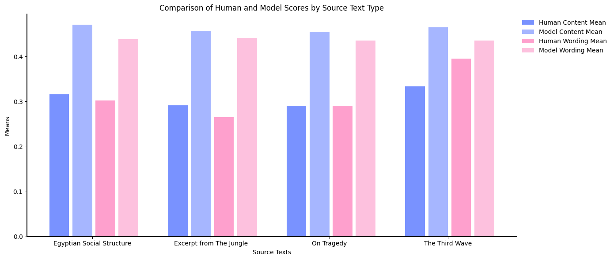

# M&M’s: A Comparative Analysis of LLMs and Mentors in Student Summary Evaluation

  

[Shijie Wang](https://witnessj.com/), [Xuanzhang Liu](), [Shan Jiang]()

> **
 Abstract:** _Utilizing large language models (LLMs) for educational assessments, particularly in summary evaluation, presents both significant potential and substantial challenges. Recent studies, such as GPT Score and G-EVAL, have explored the capability of assessing the quality of texts generated by natural language generation (NLG) systems, demonstrating a high correlation with human evaluations. However, these approaches have not comprehensively examined the performance and potential biases of large language models (LLMs) and human teachers in evaluating human-written content, such as student summaries. In this work, we employed GPT-3.5 Turbo with chain-of-thoughts (CoT) and a form-filling paradigm, to assess the quality of student summaries and conducted a comprehensive comparison with human teacher evaluations. Our findings reveal that LLMs fall short of the nuanced judgment of human teachers, particularly in terms of reliability and absence of bias, highlighting the inherent limitation of LLMs in educational applications and suggesting a critical reevaluation of their role in academic settings._ 

